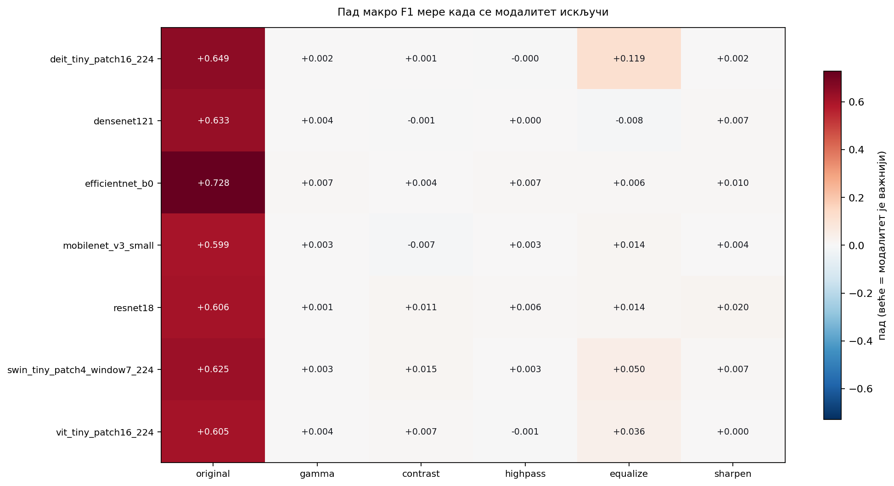
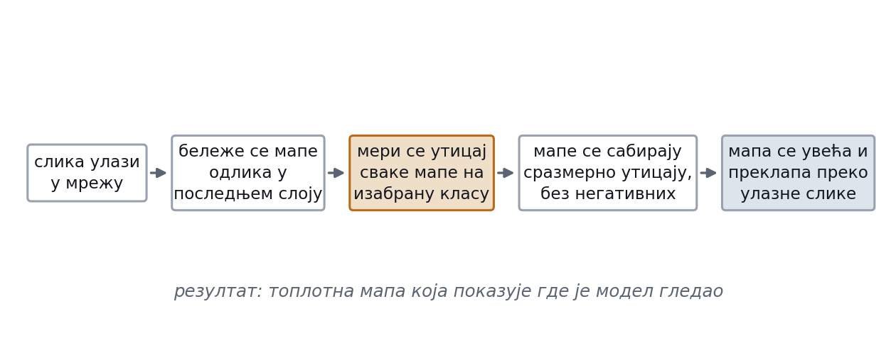

# Multimodal Galaxy Morphology Classification

Bachelor's thesis project (Faculty of Organizational Sciences, University of Belgrade, 2026).

Classifying galaxy morphology on the [Galaxy Zoo Hubble](https://huggingface.co/datasets/mwalmsley/gz_hubble)
dataset, comparing convolutional networks against vision transformers, and testing whether feeding a model
**several processed views of the same image** improves accuracy over the original image alone.

---

## Results

Seven pretrained backbones, each trained twice: on the original image only, and on a multimodal input of
six derived views. Metric is macro-F1 on a held-out test set of 750 images.

| Model | Family | Original | Multimodal | Δ |
|---|---|---|---|---|
| DenseNet121 | CNN | 0.839 | **0.844** | +0.005 |
| ResNet18 | CNN | 0.813 | 0.837 | +0.024 |
| Swin-Tiny | Transformer | 0.722 | 0.837 | **+0.115** |
| EfficientNet-B0 | CNN | **0.830** | 0.800 | −0.031 |
| DeiT-Tiny | Transformer | 0.766 | 0.778 | +0.011 |
| ViT-Tiny | Transformer | 0.765 | 0.766 | +0.001 |
| MobileNetV3-Small | CNN | **0.776** | 0.733 | −0.043 |
| *Zero-shot CLIP (baseline)* | — | *0.198* | — | — |

**Best model:** DenseNet121 with multimodal input — 0.844 macro-F1, 0.845 accuracy.

**What the ablation showed.** The multimodal input is not a free win: it helps transformers and small CNNs
with limited receptive fields, and hurts models that already extract enough from the original image
(EfficientNet-B0, MobileNetV3). The gain concentrates on the hardest, least represented class —
for Swin-Tiny, `barred_spiral` went from 0.37 to 0.76 F1.

Full per-model metrics, confusion matrices and modality-reliance weights are in [`results/`](results/).



*Ablation — how much macro-F1 each model loses when a single view is removed from the multimodal input.
The original view carries most of the signal everywhere, while histogram equalisation matters
disproportionately for DeiT-Tiny (+0.119) and Swin-Tiny (+0.050). (Axis labels are in Serbian.)*



*Grad-CAM on a correctly classified barred spiral — the model attends to the bar and the spiral arms.*

---

## Approach

**Data.** The source dataset is heavily imbalanced (from 61 to ~11,000 examples per class). A balanced
subset of 5 classes × (450 train + 100 val + 150 test) = **3,500 images** was curated, dropping one class
with too few examples to learn.

**Multimodal input.** Each image is expanded into six views — original, gamma correction, contrast
stretching, high-pass filter, histogram equalisation and sharpening — stacked along the channel axis and
passed through a learnable 1×1 adapter that projects them back to RGB before the backbone. The adapter is
initialised to pass the original view through unchanged, so the model starts from the baseline and learns
how much to rely on each view. Those learned weights are reported per model in `results/doprinos_*.json`.

**Training.** Transfer learning from ImageNet weights, a separate validation split for early stopping,
mixed-precision training, and final evaluation from the best checkpoint on a test set never used for
model selection.

**Interpretability.** Grad-CAM for CNNs and a gradient-based saliency fallback for transformers, used to
inspect which regions drive each prediction and to diagnose failure cases.

**Baseline.** A zero-shot CLIP classifier, to establish what a general-purpose model achieves on this
task without any training (0.198 macro-F1 — far below every trained model).

---

## Repository layout

```
src/gz_classifier/
  data.py                     dataset loading, splits, PyTorch wrapper
  prepare_dataset.py          curate the balanced local subset
  modalities.py               generation of the six image views
  models.py                   CNN/ViT backbones + multimodal adapter
  train.py                    training loop, early stopping, evaluation
  run_modality_experiment.py  the original-vs-multimodal experiment
  explain.py                  Grad-CAM / saliency
  zeroshot.py                 CLIP baseline
  infer.py                    load checkpoint and predict
app.py                        Streamlit demo (upload an image, get a prediction)
notebooks/                    Colab notebooks for training and analysis
scripts/                      ablation, robustness checks, figure generation
results/                      metrics, ablation output, class distribution
docs/                         figures used in the thesis
```

---

## Running it

```bash
python -m venv .venv && source .venv/bin/activate    # Windows: .\.venv\Scripts\Activate.ps1
pip install -r requirements.txt
```

Prepare the balanced subset:

```bash
python -m src.gz_classifier.prepare_dataset --output-dir data/gz_hubble_500
```

Train a single model:

```bash
python -m src.gz_classifier.train --data-dir data/gz_hubble_500 --model densenet121 \
  --modalities original gamma contrast highpass equalize sharpen \
  --epochs 30 --patience 5 --batch-size 16 --image-size 224 --amp
```

Reproduce the full experiment:

```bash
python -m src.gz_classifier.run_modality_experiment --data-dir data/gz_hubble_500 \
  --output-root outputs --epochs 50 --patience 12
```

Launch the demo app:

```bash
streamlit run app.py -- --checkpoint outputs/densenet121_multimodal/best.ckpt
```

Detailed step-by-step instructions (in Serbian) are in [`POKRETANJE.md`](POKRETANJE.md).

Trained checkpoints and the image data are not committed — run `prepare_dataset` and `train`
to regenerate them.

---

## Built with

Python · PyTorch · torchvision · timm · Hugging Face Transformers & Datasets · scikit-learn · OpenCV · Streamlit

## Licence

MIT — see [LICENSE](LICENSE).
